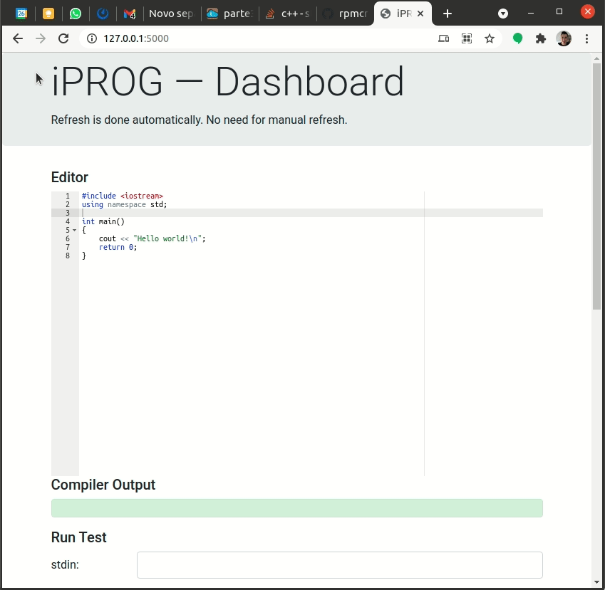

# Colab IDE

This is a very simple C/C++ editor that I use for practical lessons. It is not very efficient, but works well enough for small groups. It is written in Python/Flask.

Each user has their own editor and can see what the others are doing below. The administrator can also "clear" everything to start a new exercise.

Screenshot:

Ricardo Cruz <ricardo.pdm.cruz@gmail.com>
